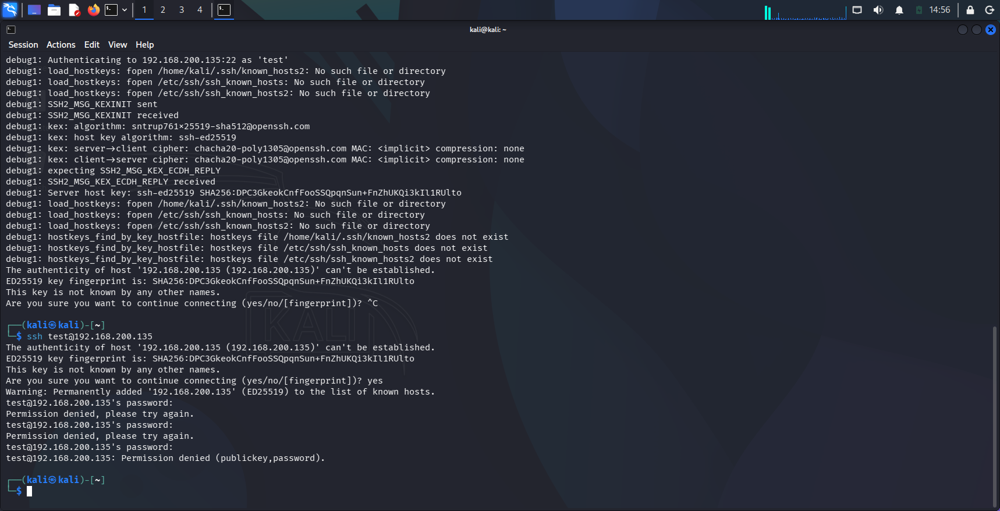
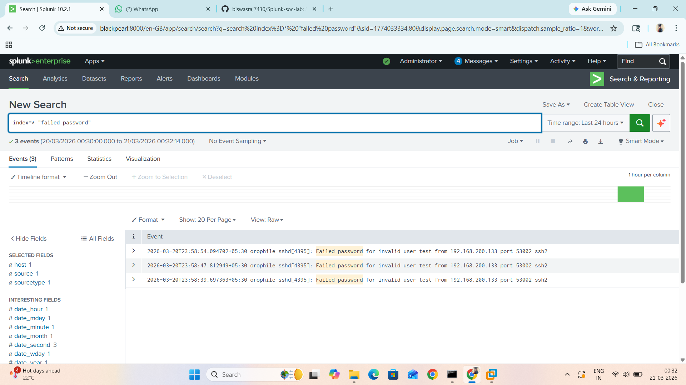
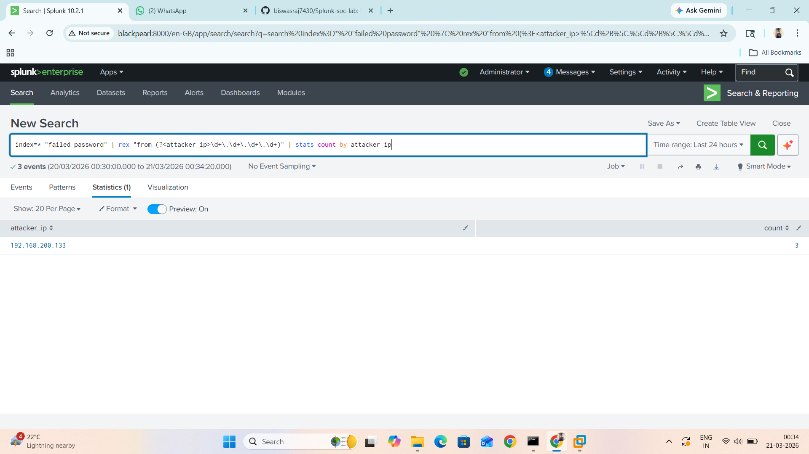
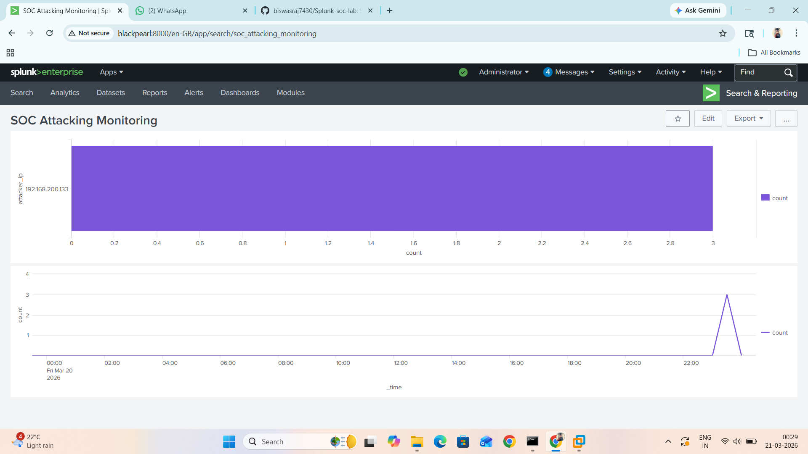

# 🔐 Splunk SOC Lab – SSH Brute Force Detection

## 📌 Project Overview
This project demonstrates detection of SSH brute-force attacks using Splunk SIEM.

## 🛠️ Lab Setup
- Attacker Machine: Kali Linux
- Victim Machine: Ubuntu Server
- SIEM Tool: Splunk Enterprise
- Log Forwarding: Splunk Universal Forwarder

## ⚔️ Attack Simulation
- SSH login attempts using invalid credentials
- Multiple failed login attempts generated from attacker machine

## 🔍 Detection Query (SPL)
spl
index=* "failed password"
| rex "from (?<attacker_ip>\d+\.\d+\.\d+\.\d+)"
| stats count by attacker_ip

## 📊 Detection Output
- Identified attacker IP generating multiple failed login attempts
- Logs successfully ingested into Splunk

## 📸 Screenshots

### 🔹 Attack Simulation

### 🔹 Logs in Splunk

### 🔹 Extracted Attacker IP

### 🔹 Dashboard

## 🚀 Skills Demonstrated
- SIEM (Splunk)
- Log Analysis
- SSH Attack Detection
- Regex (Field Extraction)
- Basic SOC Investigation

## 🎯 Use Case
Detect brute-force login attempts in real-time SOC environment.# 🔍 Detection Query (SPL)

index=* "failed password"
| rex "from (?<attacker_ip>\d+\.\d+\.\d+\.\d+)"
| stats count by attacker_ip

